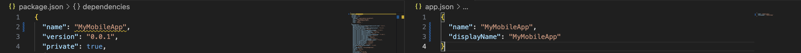

# CodePush on Android

## Create an account on App Center: https://appcenter.ms/create-account

### Install App Center CLI

```
npm install -g appcenter-cli
```

### Login to App Center CLI

- Open a terminal/command window

  ```
  appcenter login
  ```

- Copy the `API token` from the browser, and paste this into the command window.

  

- The command window will display `Logged in as {user-name}`.

  


## Create your App on App Center: https://appcenter.ms/orgs/MiniCRM/applications/create

## Make sure value of name in package.json matches the value of name in app.json



## Install package react-native-code-push

```
npm install --save react-native-code-push
```
```
yarn add react-native-code-push
```

## Android setup

1. In your `android/settings.gradle` file, make the following additions at the end of the file:

    ```gradle
    ...
    include ':app', ':react-native-code-push'
    project(':react-native-code-push').projectDir = new File(rootProject.projectDir, '../node_modules/react-native-code-push/android/app')
    ```
    
2. In your `android/app/build.gradle` file, add the `codepush.gradle` file as an additional build task definition to the end of the file:

    ```gradle
    ...
    apply from: "../../node_modules/react-native-code-push/android/codepush.gradle"
    ...
    ```

3. Update the `MainApplication.java` file to use CodePush via the following changes:

    ```java
    ...
    // 1. Import the plugin class.
    import com.microsoft.codepush.react.CodePush;

    public class MainApplication extends Application implements ReactApplication {

        private final ReactNativeHost mReactNativeHost = new ReactNativeHost(this) {
            ...

            // 2. Override the getJSBundleFile method in order to let
            // the CodePush runtime determine where to get the JS
            // bundle location from on each app start
            @Override
            protected String getJSBundleFile() {
                return CodePush.getJSBundleFile();
            }
        };
    }
    ```

4. Add the Deployment key to `strings.xml`:

   To let the CodePush runtime know which deployment it should query for updates, open your app's `strings.xml` file and add a new string named `CodePushDeploymentKey`, whose value is the key of the deployment you want to configure this app against (like the key for the `Staging` deployment for the `FooBar` app). You can retrieve this value by running `appcenter codepush deployment list -a <ownerName>/<appName> -k` in the CodePush CLI (the `-k` flag is necessary since keys aren't displayed by default) and copying the value of the `Key` column which corresponds to the deployment you want to use (see below). Note that using the deployment's name (like Staging) will not work. The "friendly name" is intended only for authenticated management usage from the CLI, and not for public consumption within your app.

   

## Multi-Deployment Testing

The [Android Gradle plugin](https://google.github.io/android-gradle-dsl/current/index.html) allows you to define custom config settings for each "build type" (like debug, release). This mechanism allows you to easily configure your debug builds to use your CodePush staging deployment key and your release builds to use your CodePush production deployment key.

To set this up, perform the following steps:

1. Open the project's app level `build.gradle` file (for example `android/app/build.gradle` in standard React Native projects)

2. Find the `android { buildTypes {} }` section and define `resValue` entries for both your `debug` and `release` build types, which reference your `Staging` and `Production` deployment keys respectively.

    ```groovy
    android {
        ...
        buildTypes {
            debug {
                ...
                // Note: CodePush updates should not be tested in Debug mode as they are overriden by the RN packager. However, because CodePush checks for updates in all modes, we must supply a key.
                resValue "string", "CodePushDeploymentKey", '""'
                ...
            }

            releaseStaging {
                ...
                resValue "string", "CodePushDeploymentKey", '"<INSERT_STAGING_KEY>"'

                // Note: It is a good idea to provide matchingFallbacks for the new buildType you create to prevent build issues
                // Add the following line if not already there
                matchingFallbacks = ['release']
                ...
            }

            release {
                ...
                resValue "string", "CodePushDeploymentKey", '"<INSERT_PRODUCTION_KEY>"'
                ...
            }
        }
        ...
    }
    ```
    
    *NOTE: Remember to remove the key from `strings.xml` if you are configuring the deployment key in the build process*

    *NOTE: The naming convention for `releaseStaging` is significant due to [this line](https://github.com/facebook/react-native/blob/e083f9a139b3f8c5552528f8f8018529ef3193b9/react.gradle#L79).*

## Usage

- Call codePush.sync() in App.js after mounting:

  ```
  App.js

  async componentDidMount() {
    if (__DEV__ === false) {
      codePush.sync({
        updateDialog: true,
        checkFrequency: codePush.CheckFrequency.ON_APP_START,
      });
    }
  ```

- Releasing Updates

  Taking advantage of the `Staging` and `Production` deployments allows you to achieve a workflow like the following (feel free to customize!):

  1. Release a CodePush update to your `Staging` deployment using the `appcenter codepush release-react` command (or `appcenter codepush release` if you need more control)

  2. Run your staging/beta build of your app, sync the update from the server, and verify it works as expected

  3. Promote the tested release from `Staging` to `Production` using the `appcenter codepush promote` command

  4. Run your production/release build of your app, sync the update from the server and verify it works as expected

- If getting `com.microsoft.codepush.react.CodePushUnknownException: Error in getting binary resources modified time` on codepush, modify android defaultConfig:

  ```
  android {
      ...

      defaultConfig {
      ...
          resValue 'string', "CODE_PUSH_APK_BUILD_TIME", String.format("\"%d\"", System.currentTimeMillis())
      ...
      }

      ...
  ```