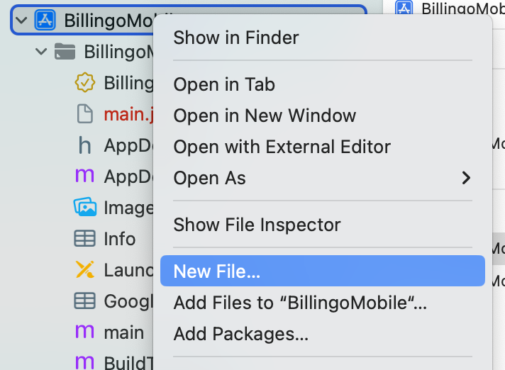
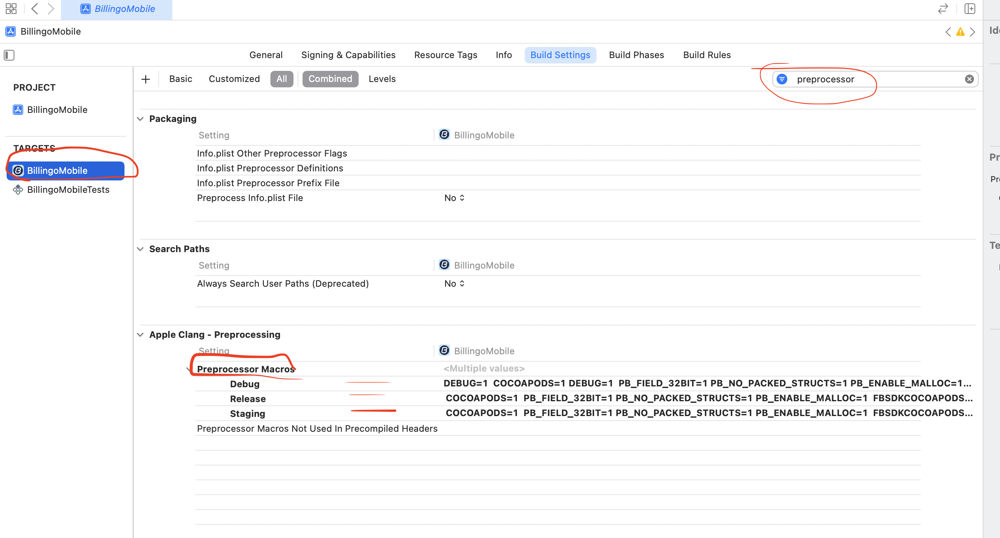

# Native Module

## `src/services/BuildTypeModule.js`

```
import {NativeModules} from 'react-native';

const {BuildTypeModule} = NativeModules;

export default BuildTypeModule;
```

### Usage

```
import BuildTypeModule from '..../BuildTypeModule';

await BuildTypeModule.getBuildType();
```

# Android

## `android/app/build.gradle`

```
android {
    ...
    buildTypes {
        debug {
            ...
            buildConfigField "String", "BUILD_TYPE", "\"debug\""
        }
        releaseStaging {
            ...
            buildConfigField "String", "BUILD_TYPE", "\"staging\""
        }
        release {
            ...
            buildConfigField "String", "BUILD_TYPE", "\"release\""
        }
    }
    ...
}
```

## `android/app/src/main/java/com/PROJECT_NAME/mobile/BuildTypeModule.java`

```
package com.your.project;

import com.facebook.react.bridge.Promise;
import com.facebook.react.bridge.ReactApplicationContext;
import com.facebook.react.bridge.ReactContextBaseJavaModule;
import com.facebook.react.bridge.ReactMethod;
import com.your.project.BuildConfig;

public class BuildTypeModule extends ReactContextBaseJavaModule {

    public BuildTypeModule(ReactApplicationContext reactContext) {
        super(reactContext);
    }

    @Override
    public String getName() {
        return "BuildTypeModule";
    }

    @ReactMethod
    public void getBuildType(Promise promise) {
        promise.resolve(BuildConfig.BUILD_TYPE);
    }
}
```

## `android/app/src/main/java/com/PROJECT_NAME/mobile/BuildTypePackage.java`

```
package com.your.project;

import com.facebook.react.ReactPackage;
import com.facebook.react.bridge.NativeModule;
import com.facebook.react.bridge.ReactApplicationContext;
import com.facebook.react.uimanager.ViewManager;

import java.util.ArrayList;
import java.util.Collections;
import java.util.List;

public class BuildTypePackage implements ReactPackage {

    @Override
    public List<ViewManager> createViewManagers(ReactApplicationContext reactContext) {
        return Collections.emptyList();
    }

    @Override
    public List<NativeModule> createNativeModules(
                            ReactApplicationContext reactContext) {
        List<NativeModule> modules = new ArrayList<>();

        modules.add(new BuildTypeModule(reactContext));

        return modules;
    }
}
```

## `android/app/src/main/java/com/PROJECT_NAME/mobile/MainApplication.java`

```
...
        @Override
        protected List<ReactPackage> getPackages() {
          @SuppressWarnings("UnnecessaryLocalVariable")
          List<ReactPackage> packages = new PackageList(this).getPackages();
          ...
            packages.add(new BuildTypePackage());

          return packages;
        }
...
```

# iOS 

## Create new files

* `Objective-C File` -> `BuildTypeModule.m`
* `Header File` -> `BuildTypeModule.h`



## `BuildTypeModule.h`

```
#import <React/RCTBridgeModule.h>

@interface RCT_EXTERN_MODULE(BuildTypeModule, NSObject)

RCT_EXTERN_METHOD(getBuildType:(RCTPromiseResolveBlock)resolve
                  rejecter:(RCTPromiseRejectBlock)reject)

@end
```

## `BuildTypeModule.m`

```
#import "BuildTypeModule.h"

@implementation BuildTypeModule

RCT_EXPORT_MODULE();

RCT_EXPORT_METHOD(getBuildType:(RCTPromiseResolveBlock)resolve
                  rejecter:(RCTPromiseRejectBlock)reject)
{
    #if DEBUG
        resolve(@"Debug");
    #elif STAGING
        resolve(@"Staging");
    #else
        resolve(@"Release");
    #endif
}

@end
```

## Preprocessors

* `Debug` -> `DEBUG=1`
* `Staging` -> `STAGING=1`
* `Release` -> `RELEASE=1`


