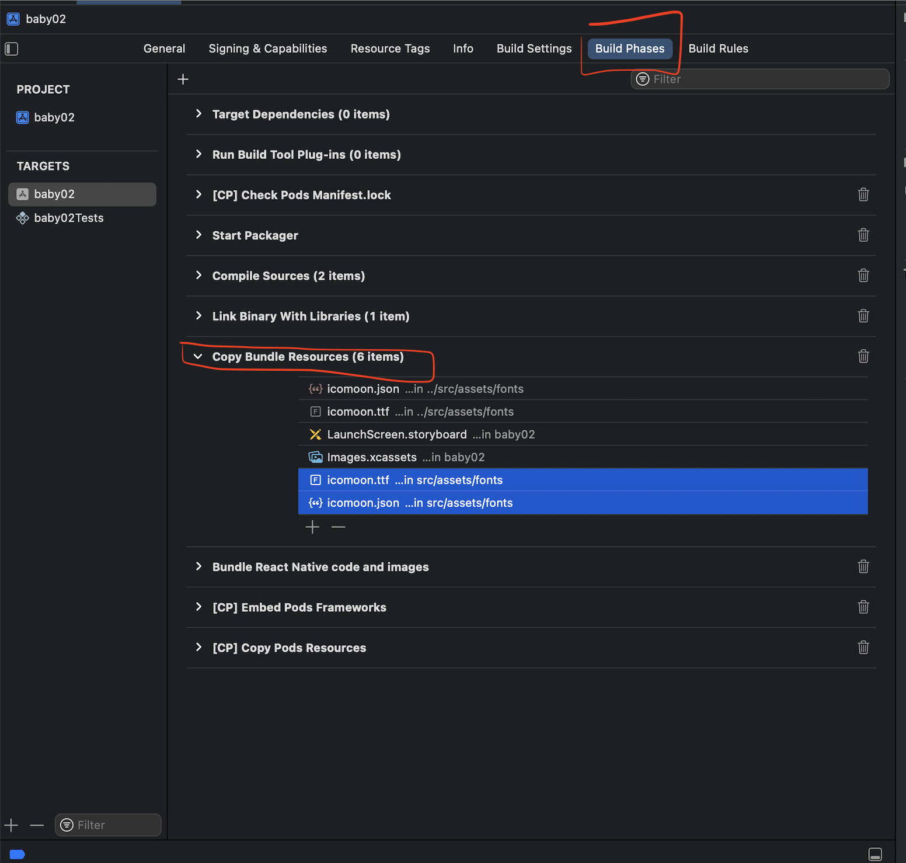

# 'React/RCTBridge.h' file not found, 'React/RCTComponent.h' file not found

* adding all this dependencies to `Podfile`

```
pod 'React', :path => '../node_modules/react-native/'
pod 'React-Core', :path => '../node_modules/react-native/'
pod 'React-CoreModules', :path => '../node_modules/react-native/React/CoreModules'
pod 'React-Core/DevSupport', :path => '../node_modules/react-native/'
pod 'React-RCTActionSheet', :path => '../node_modules/react-native/Libraries/ActionSheetIOS'
pod 'React-RCTAnimation', :path => '../node_modules/react-native/Libraries/NativeAnimation'
pod 'React-RCTBlob', :path => '../node_modules/react-native/Libraries/Blob'
pod 'React-RCTImage', :path => '../node_modules/react-native/Libraries/Image'
pod 'React-RCTLinking', :path => '../node_modules/react-native/Libraries/LinkingIOS'
pod 'React-RCTNetwork', :path => '../node_modules/react-native/Libraries/Network'
pod 'React-RCTSettings', :path => '../node_modules/react-native/Libraries/Settings'
pod 'React-RCTText', :path => '../node_modules/react-native/Libraries/Text'
pod 'React-RCTVibration', :path => '../node_modules/react-native/Libraries/Vibration'
pod 'React-Core/RCTWebSocket', :path => '../node_modules/react-native/'
```

* then run
* `cd ios`
* `rm -rf Pods`
* `pod deintegrate`
* `pod install`

# error: Multiple commands produce


